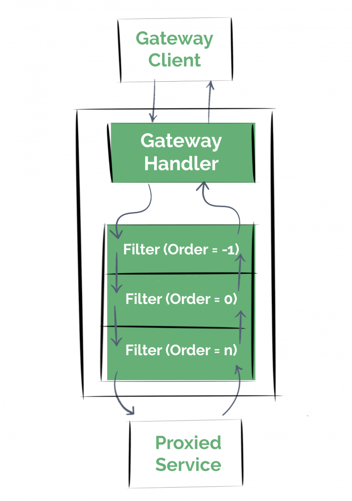

# Spring Cloud Gateway ( API GW )

<br/>

API 를 이해 하고 실습 할수 있다.   

<br/>


1. WebFlux  

2. Spring Cloud Gateway    

3. SCG Demo 실습

4. 과제

<br/>

## WebFlux 란

<br/>

### 개요

<br/>

참고  
- 우아한 형제 10분 톡 : https://youtu.be/wQFBgKl1PYw?si=4S6pnkvgCBS_jJJU  
- webflux 란 무엇인가 : https://devmoony.tistory.com/174  

<br/>  


WebFlux는 Spring 5에서 새롭게 추가된 Reactive-Stack의 웹 프레임워크이며, 클라이언트/서버에서 리액티브(reactive) 애플리케이션 개발을 위한 논블로킹 리액티브 스트림을 지원한다.    

2017년 8월에 릴리즈되어 Spring5에 새롭개 추가된 WebFlux가 생긴 이유는,  

- 적은 양의 스레드와 최소한의 하드웨어 자원으로 동시성을 핸들링 하기 위해 만들어졌다.  
- 함수형 프로그래밍 때문이다. Java5에서 RestController나 unit test가 만들어지고, Java8에서 함수형 API를 위한 람다식이 추가됐는데 이는 논블로킹(non-blocking)어플리케이션 API의 토대가 됐다.  

<br/>

### WebFlux 의 등장

<br/>

WebFlux는 논블로킹으로 동작하는 웹 스택의 필요성 때문에 등장하게 되었다. 기존 SpringMVC의 Servlet API는 v3.1부터 논블로킹을 위한 API를 제공했었다. 하지만 이외의 동기적으로 처리하는 모듈(Filter, Servlet)과 블로킹 방식의 API(getParameter, getPart)들이 있기에 완벽한 논블로킹 환경의 개발을 할 수 없었으며, 비동기 논블로킹 환경의 서버로 Netty가 부상하고 있었으며 이 Netty와의 연동을 위해 Spring은   
새로운 API가 필요했다.

<br/>

이러한 Spring WebFlux는 아래와 같은 용도로 사용하기를 추천한다고 한다.

- 비동기, non-blocking reactive 개발에 사용하는 경우
- 효율적으로 동작하는 고성능 웹어플리케이션 개발에 사용
- 서비스간 호출이 많은 마이크로서비스 아키텍처에 적합  

일반적으로 blocking 코드 작성에는 익숙하기 때문에 생산성이 높을 것이나 non-blocking 코드에는 익숙하지 않고 확실히 이해하고 코딩하지 않으면 알 수 없는 오류도 발생하기 쉽고 디버깅도 어렵기 때문에 학습이 필요하다. 그리고 non-blocking과 blocking코드를 같이 사용하게 되면 비동기 코드가 무의미해지고 성능적인 이점도 볼 수 없기 때문에 고려해야할 부분도 많다.  

<br/>

### Spring MVC vs WebFlux  

<br/>


다음은 Spring Mvc와 WebFlux의 차이를 알아보자.    

Spring MVC와 WebFlux의 공통점은 @Controller, Reactive클라이언트이다. 둘 모두 Tomcat, Jetty, Undertow와 같은 서버에서 실행할 수 있다.  

Spring MVC에서는 명령형 논리, JBDC, JPA를 가질수 있고, Spring WebFlux에서는 기능적 엔트 포인트, 이벤트 루프, 동시성 모델을 가질 수 있다.   

<br/>

#### Spring MVC

<br/>

Spring MVC는 하나의 요청에 대해 하나의 스레드가 사용된다(thread-per-request). 그래서 다량의 요청을 대비해 미리 스레드 풀을 생성해놓으며, 각 요청마다 스레드를 할당하여 처리한다.  

- 1 request : 1 thread  
- sync + blocking

<br/>

#### WebFlux  

<br/>


리액티브 프로그래밍은 논블로킹과 고정된 스레드 수 만으로 모든 요청을 처리함으로 Spring MVC의 문제들을 해결한다.  

서버는 스레드 한 개로 운영하며, 디폴트로 CPU 코어 수 개수의 스레드를 가진 워커 풀을 생성하여 해당 워커 풀 내의 스레드로 모든 요청을 처리한다. 제약이 있다면 논블로킹으로 동작해야만 하며, 블로킹 라이브러리가 필수적으로 사용되어야 한다면, 워커 스레드가 아닌 외부 별도의 스레드로 요청을 처리해야한다. 이는 요청을 처리하는 Event Loop가 절대 블로킹되지 않아야 하기 때문이다.  

- many request : 1 thread
- async + nonblock  


WebFlux로 개발하고 DB는 blocking이라면? WebFlux를 쓸 이유가 없다. 라는 개념 아래서 reactive를 지원하는 DB를 사용해야 하는데 우리가 일반적으로 알고있는 RDBMS는 지원하지 않고 Redis, Mongo 등은 지원한다.  

<br/>


## Spring Cloud Gateway

<br/>

참고 :   
- Spring Cloud 이해 : https://adjh54.tistory.com/207 
- https://mangkyu.tistory.com/230    
- https://wildeveloperetrain.tistory.com/207  
- https://linked2ev.github.io/gitlog/2022/02/16/SCG-1.-Spring-Cloud-Gateway-%EC%84%A4%EC%A0%95(1)-Routing/   
- 토스 API GW : https://youtu.be/Zs3jVelp0L8?si=-VsXDdUAL8y-kde9  
- https://github.com/kirobo77/scg/blob/main/APIGateway.md


<br/>

###  Spring Cloud Gateway란? 

<br/>  

- Spring 생테계를 기반으로 하는 API Gateway를 제공해주는 프로젝트  
- API Gateway가 필요한 이유는안전한 API유통과 Client 요청별로 유연하게 대처하기 위해서 필요하다.  
- API Gateway는 인증/인가, L/B & 라우팅, 로깅, Circuit Breaker의 역할을 합니다.  
- Spring Cloud Gateway는 간단하지만 효율적인 방법으로 API를 라우팅하는 방법을 제공함  
- 그 외에도 security, monitoring/metrics, resiliency 등과 같은 공통 관심사를 처리해줌  
- 최신의 버전은 Spring 6, Spring Boot 3 and Project Reactor를 기반으로 동작    

<br/>

### SCG vs Zuul

<br/>

#### 1. Blocking vs non-Blocking

<br/>

> Zuul is built on servlet 2.5 (works with 3.x), using blocking APIs. 
It doesn't support any long lived connections, like websockets  

> Gateway is built on Spring Framework 5, Project Reactor and 
Spring Boot 2 using non-blocking APIs. 
Websockets are supported and it's a much better developer experience 
since it's tightly integrated with Spring.  


> Zuul은 서블릿 2.5 위에서 Blocking API들을 사용하여 개발되었습니다. 
그래서 웹소켓과 같은 길게 지속되는 연결을 지원하지 않습니다.   

> SCG는 Spring Framework 5, Project Reactor 그리고 Spring Boot2 위에서 
non-Blocking API들을 사용하여 개발되었습니다. 
웹소켓이 지원되고, Spring과 잘 연동되기 때문에 개발자 경험을 매우 크게 향상시킵니다.     

<br/>

Blocking 방식은 요청을 보내고 응답이 올때까지 다음으로 진행하지 않고 기다립니다.   

non-Blocking방식은 요청을 보내고 바로 다음으로 진행하여 다른 일을 하다가, 응답이 오면 그에 맞는 처리를 합니다.     

Zuul 1.x는 blocking방식의 단점을 해결하기 위해 Thread pool을 사용했습니다.  

각 트랜잭션이 별도의 Pool에서 수행되므로, 어느 정도는 blocking방식의 문제를 해결할 수 있었습니다.    

그러나, Zuul의 태생이 Netflix OSS여서 그런지 Spring Cloud와는 잘 안 맞는 면이 좀 있었던것 같습니다.   

그래서 Spring Cloud 커뮤니티에서 내놓은 새로운 API Gateway가 Spring Cloud Gateway입니다.   

<br/>

최근의 테스트에서는 SCG가 훨씬 더 나은 성능을 보이는것으로 나옵니다.     

http://www.bytesville.com/zuul-spring-cloud-gateway-comparison-benchmarks-loadtesting/   

<br/>

  

<br/>

#### 2.  Filter only vs Predicates+Filters

<br/>

Zuul과 SCG는 동작원리 측면에서도 많이 다릅니다.   

Zuul이 Filter들만으로 동작하는 반면에, SCG는 Predicates(수행을 위한 사전 요구조건)와 Filter를 조합하여 동작합니다.  

<br/>

    


    

<br/>

Gateway Handler Mapping이 Predicates에 지정한 경로와 일치하는지 판단하고, Gateway Web Handler는 지정된 필터들을 통해 요청을 전송합니다.   

필터들은 요청과 응답에 대한 처리를 수행합니다. 

<br/>

#### 3. Tomcat vs Netty

<br/>

Zuul은 Web/WAS로 Tomcat을 사용하고, SCG는 Netty를 사용합니다.  

Netty는 비동기 네트워킹을 지원하는 어플리케이션 프레임워크입니다.     

<br/>


### Spring Cloud Gateway 의 동작 순서

<br/>

1. Client는 Spring Cloud Gateway 서버로 요청을 보냄
2. Gateway Handler Mapping에서 요청이 매핑된다고 판단하면 Gateway Web Handler로 요청을 보냄
3. Gateway Web Handler는 매핑되는 요청을 위한 필터 체인을 거쳐 요청을 실행함

<br/>

  


<br/>

### Spring Cloud Gateway 구성요소  

<br/>

Spring Cloud Gateway의 구성은 크게 Route, Predicate, Filter 3가지로 구성**되어 있는데요. 각각에 대해 살펴보면 다음과 같습니다.  

- Route

  Route는 API Gateway에서 가장 기본이 되는 요소로 요청할 서비스의 고유한 값인 id, 요청할 uri, Predicate, Filter로 구성되어 있습니다.   

  요청된 uri의 조건이 predicate와 일치하는지 확인 후, 일치하는 경우 해당 uri 경로로 요청을 매칭 시켜줍니다.

<br/>

- Predicate

  API Gateway로 들어온 요청이 주어진 조건을 만족하는지 확인하는 구성요소입니다.  

  하나 이상의 조건을 정의할 수 있으며, 만약 Predicate 조건에 맞지 않는 경우 HTTP 404 Not Found 응답을 반환 합니다.   

<br/>

- Filter

  API Gateway로 들어오는 요청에 대해 Filter를 적용하여 선처리 및 후처리를 할 수 있게 해주는 구성요소입니다.    

<br/>

### filter

<br/>


  

<br/>

클라이언트는 Spring Cloud Gateway를 통해 요청을 하고 게이트웨이는 매핑에서 요청이 경로와 일치한다고 판단하면 게이트웨이 웹 처리기로 요청을 전송하게 됩니다.  

<br/>

Spring Cloud Gateway Document  

<br/>

      

<br/>

```bash
public class LoggingGatewayFilterFactory extends AbstractGatewayFilterFactory<LoggingGatewayFilterFactory.Config> {
    public LoggingGatewayFilterFactory() {
        super(Config.class);
    }

    @Override
    public GatewayFilter apply(Config config) {
        return (exchange, chain) -> {
            if (config.isPreLogger()) {
                log.info("Pre GatewayFilter logging: " + config.getBaseMessage());
            }

            return chain.filter(exchange)
                    .then(Mono.fromRunnable(() -> {
                        if (config.isPostLogger()) {
                            log.info("Post GatewayFilter logging: " + config.getBaseMessage());
                        }
                    }));
        };
    }

    @NoArgsConstructor
    @AllArgsConstructor
    @Getter
    @Setter
    public static class Config {
        private String baseMessage;
        private boolean preLogger;
        private boolean postLogger;
    }
}
```  

<br/>

필터는 모두 AbstractGatewayFilterFactory를 상속받아 구현을 진행합니다.   

<br/>

## SCG Demo 실습

<br/>

참고  
- https://wildeveloperetrain.tistory.com/207

<br/>

현재 edu25 에는 apache 인 `httpd` 서비스와 `nginx` 서비스가 있다.  

spring cloud gateway 에서 `route` 기능을 이용하여 nginx 와 httpd를 설정한다.

<br/>

웹 브라우저에서 아래 2개를 호출 해봅니다.  
-  https://apigw-simple-edu25.apps.okd4.ktdemo.duckdns.org/httpd    

<br/>

  

<br/>

-  https://apigw-simple-edu25.apps.okd4.ktdemo.duckdns.org/nginx

<br/>

  

<br/>

`https://github.com/shclub/edu_springcloud_gw_simple` 를 fork 합니다.

`/src/main/resources` 폴더의  `application-dev.yml` 화일의 내용을 확인합니다.  

<br/>

```bash
...
spring:
  cloud:
    gateway:
      routes:
        - id: nginx-service
          uri: http://nginx.edu25.svc.cluster.local  # k8s 의 서비스
          predicates:
            - Path=/nginx/**  #  URL Prefix
          filters:
            - RewritePath=/nginx/?(?<path>.*),/$\{path} #  redirect path 설정. predicates의 path가 앞에추가
        - id: httpd-service
          uri: http://httpd.edu25.svc.cluster.local
          predicates:
            - Path=/httpd/**
          filters:
            - RewritePath=/httpd/?(?<segment>.*), /$\{segment}
...            
```  

<br/>

Github Action 으로 Docker image를 생성하고 deployment 와 service를 생성합니다.

```bash
[root@bastion istio]# cat springcloudgw_simple_manifest.yaml
apiVersion: apps/v1
kind: Deployment
metadata:
  name: springcloud-simple-gateway
spec:
  replicas: 1
  revisionHistoryLimit: 3
  selector:
    matchLabels:
      app: scg-simple
  template:
    metadata:
      labels:
        app: scg-simple
    spec:
      containers:
      - name: scg-simple
        image: ghcr.io/******/edu_springcloud_gw_simple:v1 ## 이미지 변경
        imagePullPolicy: Always
        env:
          - name: SPRING_PROFILES_ACTIVE
            value: "dev"
        ports:
        - containerPort: 8800
---
apiVersion: v1
kind: Service
metadata:
  name: springcloud-simple-gateway
  labels:
    app: scg-simple
spec:
  ports:
  - port: 80
    targetPort: 8800
    name: http
  selector:
    app: scg-simple
  type: ClusterIP
```  

<br/>

route 를 생성합니다.  

```bash
[root@bastion istio]# cat springcloudgw_simple_route.yaml
apiVersion: route.openshift.io/v1
kind: Route
metadata:
  labels:
    app : apigw-simple
  name: apigw-simple
spec:
  port:
    targetPort: http
  tls:
    termination: edge
  to:
    kind: Service
    name: springcloud-simple-gateway
    weight: 100
  wildcardPolicy: None
```  

<br>

Actuator 로 routing 정보를 확인 합니다.  
- https://apigw-simple-edu25.apps.okd4.ktdemo.duckdns.org/actuator/gateway/routes  

<br/>

  

<br/>

웹브라우저에서 route 로 접속하여 routing 이 되는 것을 확인해 봅니다.

<br/>

## 과제

<br/>

### 로깅 필터   

<br/>


참고 : https://kingchan223.tistory.com/398

API Gateway 에 로깅 필터를 추가해 봅니다.  

필터는 Pre Filter(사전 필터)와 Post Filter(사후 필터)로 나뉘며, Property혹은 Java Code로 직접 로직을 작성할 수도 있다.    

<br/>


  


<br/>

먼저 자바코드를 사용하여 필터를 추가하는 방법을 알아보자.
- https://www.4te.co.kr/926  


<br/>


      

<br/>

org.springframework.core.Ordered 인터페이스를 구현하게 되면 순서에 따라 실행 되는데, 아래 그림에서 볼 수 있는 것 처럼 숫자가 작으면 pre 일경우 먼저 실행 되지만 post 일 경우에는 나중에 실행되게 된다.  


```bash
public class RewriteGlobalFilter implements GlobalFilter, Ordered {

    @Autowired
    private ModifyRequestBodyGatewayFilterFactory modifyRequestBodyFilter;

    @Autowired
    private RequestBodyTransform requestBodyTransform;

    @Override
    public Mono<Void> filter(ServerWebExchange exchange, GatewayFilterChain chain) {
        log.info("===================== pre filter =====================");

        chain.filter(exchange).then(Mono.fromRunnable(() -> {
            log.info("X_GUID : ", exchange.getRequest().getHeaders().get("x_guid"));
        }));

        HttpHeaders headers = exchange.getRequest().getHeaders();

        return modifyRequestBodyFilter
                .apply(new ModifyRequestBodyGatewayFilterFactory
                        .Config()
                        .setRewriteFunction(String.class, String.class, requestBodyTransform))
                .filter(exchange, chain)
                .then(Mono.fromRunnable(() -> {
                    log.info("===================== post filter =====================");
                }));
    }

    @Override
    public int getOrder() {
        return -1;
    }
}
```  

<br/>

### ISTIO 와 Spring Cloud Gateway 같이 사용하기      

<br/>

istio 에서 생성한 istio ingress gateway 앞에 Spring Cloud Gateway 를 위치하고 Frontend 에서는 Spring Cloud Gateway 를 호출 하게 한다.    

<br/>

먼저 spring cloud gateway 를 생성한다.    

```bash
[root@bastion istio]# cat springcloudgw_manifest.yaml
apiVersion: apps/v1
kind: Deployment
metadata:
  name: springcloud-gateway
spec:
  replicas: 1
  revisionHistoryLimit: 3
  selector:
    matchLabels:
      app: scg
  template:
    metadata:
      labels:
        app: scg
    spec:
      containers:
      - name: scg
        image: ghcr.io/shclub/gw-edu:v2
        imagePullPolicy: Always
        env:
          - name: SPRING_PROFILES_ACTIVE
            value: "dev"
        ports:
        - containerPort: 8800
---
apiVersion: v1
kind: Service
metadata:
  name: springcloud-gateway
  labels:
    app: scg
spec:
  ports:
  - port: 80
    nodePort: 31498
    targetPort: 8800
    name: http
  selector:
    app: scg
  type: ClusterIP
```  
```bash  
[root@bastion istio]# kubectl apply -f springcloudgw_manifest.yaml
```  

<br/>

서비스와 pod 를 확인한다. 

```bash
[root@bastion istio]# kubectl get po
NAME                                                    READY   STATUS    RESTARTS   AGE
backend-springboot-7d5f8678cf-x5jkj                     2/2     Running   0          38h
edu25-ingressgateway-7d85fbfcbd-lhng8                   1/1     Running   0          19h
elastic-agent-integrations-deployment-fd85dfd6b-jvfwx   1/1     Running   0          15d
frontend-react-645d46ccf8-s6pw4                         2/2     Running   0          45m
nginx-deployment-56569bbd7d-cq5cl                       2/2     Running   0          140m
springcloud-gateway-6fc95f9d78-6npxv                    2/2     Running   0          94m
[root@bastion istio]# kubectl get svc
NAME                         TYPE        CLUSTER-IP       EXTERNAL-IP   PORTbackend-springboot           NodePort    172.30.106.41    <none>        80:31545/TCP                                 12d
edu25-ingressgateway         NodePort    172.30.46.225    <none>        15021:32545/TCP,80:32154/TCP,443:30470/TCP   19h
elastic-agent-integrations   ClusterIP   172.30.65.7      <none>        8125/UDP                                     15d
frontend-react               ClusterIP   172.30.240.142   <none>        80/TCP                                       14d
nginx                        ClusterIP   172.30.106.176   <none>        80/TCP                                       141m
springcloud-gateway          NodePort    172.30.213.23    <none>        80:31498/TCP                                 20h
```  

<br/>

- 변경 : frontend-react deploy 수정
  - 이미지 버전 변경
  - BACKEND_API_URL : 본인의 springcloud service 이름  


<br/>

frontend-react deploy 에서 아래와 같이 yaml 화일을 변경하면 된다.  

```bash
    spec:
      containers:
        - name: frontend-react
          image: 'ghcr.io/shclub/edu12-3:v6' ## 버전 다시 생성
          ports:
            - containerPort: 80
              protocol: TCP
          env:
            - name: BACKEND_API_URL
              value: 'http://' # 본인의 spring cloud service  이름
```

<br/>

서비스를 수정후에 웹브라우저에 frontend-react route로 이동하여 해당 페이지에서 로그인을 한후 데이터 생성을 한다.

kiali 에 접속하며 본인 서비스가 잘 호출 되었는지 확인한다.  


  

<br/>

spring cloud gateway에 로그 필터를 설정하여 모든 로그를 write 하도록 설정하였습니다.

해당 pod 에서 로그를 확인합니다.  

  

